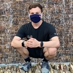

___

## I am a cybersecurity student, developer, and Linux administrator.  I participate in the National Cyber League and educate students about Linux usage and security whenever possible.

 * #### I worked at [Summit Technology Academy](https://sta.lsr7.org/) during the summer and helped train younger students on the urgency of cybersecurity in the workforce today.
 * #### While at these sessions, I have worked on a group project called the Summit Technology Academy Scoring System [STASC](https://gitlab.com/summit-technology-academy/stasc).
* #### I have placed in the top 500 twice in the gold division of the [National Cyber League](nationalcyberleague.org) (scouting reports available upon request).

___

## What have I done in regards to software?

#### Throughout the years, I have a series of project that I like to do on my freetime for practical use, or just for fun.

|

|

|
|-|-|
|https://github.com/mksipe|https://gitlab.com/mksipe|

#### Here are some personal projects that I am especially proud of.

|HTS4|SSL|DBCrack|Caecrack|
|-|-|-|-|
|github.com/mksipe/HTS4|github.com/mksipe/shell-script-lib|github.com/mksipe/dbcrack|github.com/caecrack|
|This tool was my first attempt at applying the rust language to find vulnerable software and pen-testing tools on a Linux/mac/windows system. | This was one of my very first projects on Github that I started while still in cyberpatriot. SSL was designed to help make hardening the Linux system easier. | This was my first attempt to make a password cracker in python. The project switched it to rust to help with resource efficiency and stability to make processing as fast as possible. The fundamental issue was using SQLite, and I learned a valuable lesson when choosing a database.| Caecrack was a shot as making an automatic Ceasar cipher cracker to make a mass toolkit in the National Cyber League to make the cryptography section easier.|

## Group / Community Projects

#### I have been active when it comes to helping the community with different issues regarding open source software. 

### [Summit Technology Academy Scoring System](https://gitlab.com/summit-technology-academy/stasc)

> #### This project was designed to make custom images that are intentionally vulnerable to determine who is learning in the classroom during a cybercamp session. This project was designed around modularity, such as choosing which vulnerabilities in what system and giving feedback upon completion or failure of securing the exposure.

### [Lynis](https://github.com/CISOfy/lynis)
> #### When I find issues within certain projects such as applied hardening software, I try to point this out and send a fix to help the community as a whole.

___