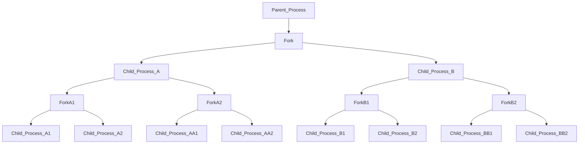

<p style="text-align: center; font-size: 40px;">Hardening the Linux Kernel</p>

---

##### Metadata

###### Last revised - 10/8/21

###### Author       - Mason Sipe

---

## Preamble

This post is about hardening the core components of the Linux kernel.
The article will cover a majority of commonly misconfigured settings in different system files for daily usage of the Linux system. This post will also help with restricting available information that may be valuable to a perpetrator.

---

## Table of Contents

- [Hardening the Linux Kernel](#table-of-contents)
    - [Disabling Core Dumps](#disabling-core-dumps)
    - [Wabbit Mitiation](#preventing-a-fork-bomb-rabbit-virus-wabbit)
    - [SystemCtl](#systemctl)

### Disabling Core Dumps

According to Vivek Gite: "Core dumps created for diagnosing and debugging errors in Linux apps. They are also known as memory dump, crash dump, system dump, or ABEND dump. However, core dumps may contain sensitive info—for example, passwords, user data such as PAN, SSN, or encryption keys. Hence, we must disable them on production Linux servers."

From this, you can infer that the information stored in core dumps may be susceptible if not kept securely or stored. 

To disable core dumps, you will need to add this line in `/etc/security/limits.conf`

```
* hard core 0
* soft core 0
```

Then, in `/etc/sysctl.conf` add the following line:
```
fs.suid_dumpable = 0
kernel.core_pattern=|/bin/false

``` 


### Preventing a Fork Bomb (rabbit virus, wabbit)

A fork bomb is of what follows: `:(){ :|:& };:`. (DO NOT RUN THIS IN A SHELL)

This process continuously creates child processes that infinitely spawn their processes, depleting your system of resources. 




A detailed explanation of how fork bombs work is in [this](https://www.cyberciti.biz/faq/understanding-bash-fork-bomb/) article.

To prevent fork bombs, you need to add this line to: `/etc/security/limits.conf`


```bash
<$USER> hard noproc 300
@student hard nproc 50
@faculty soft nproc 100
@pusers hard nproc 200
```

### Systemctl 

The following settings are stored in `/etc/sysctl.conf`


#### Packet Forwarding

```bash
# Controls IP packet forwarding
net.ipv4.ip_forward = 0
```

#### No Routing

```bash
# Do not accept source routing
net.ipv4.conf.default.accept_source_route = 0
```

#### SysRQ

```bash
# Controls the System Request debugging functionality of the kernel
kernel.sysrq = 0
```
#### Core Dumps Append PID

```bash
# Controls whether core dumps will append the PID to the core filename
# Useful for debugging multi-threaded applications
kernel.core_uses_pid = 1
```

#### Syn-Flood Protection

```bash
# Controls the use of TCP syncookies
# Turn on SYN-flood protections
net.ipv4.tcp_syncookies = 1
net.ipv4.tcp_synack_retries = 5
```

#### Disable IPv4 Routing

```bash
net.ipv4.conf.all.send_redirects = 0
net.ipv4.conf.default.send_redirects = 0
```

#### Deny Secure Routing (we are not a router)

```bash
net.ipv4.conf.all.accept_source_route = 0
```


#### We do Not Redirect Traffic

```bash
net.ipv4.conf.all.accept_redirects = 0
net.ipv4.conf.all.secure_redirects = 0
```

#### Log Impossible Addresses

```bash
net.ipv4.conf.all.log_martians = 1
net.ipv4.conf.default.accept_source_route = 0
net.ipv4.conf.default.accept_redirects = 0
net.ipv4.conf.default.secure_redirects = 0
```

#### Ignore ICMP Requests and Broadcasts

```bash
net.ipv4.icmp_echo_ignore_broadcasts = 1
```

#### Prevent Against Common Syn Flood Attacks

```bash
net.ipv4.tcp_syncookies = 1
```

#### Source Validation by Reverse Path

```bash
net.ipv4.conf.all.rp_filter = 1
```

#### Default Source Route Verification

```bash
net.ipv4.conf.default.rp_filter = 1 
```


#### This is a Host

```bash
net.ipv6.conf.default.router_solicitations = 0
```

#### Accept Router's Preference in Router Advertisements

```bash
net.ipv6.conf.default.accept_ra_rtr_pref = 0
```


#### Learn Prefix in Routers Advertisement

```bash
net.ipv6.conf.default.accept_ra_pinfo = 0
```


#### Accept Hop Limit 

```bash
net.ipv6.conf.default.accept_ra_defrtr = 0
```


#### Assign Global Unicast Address on an Interface

```bash
net.ipv6.conf.default.autoconf = 0
```


#### Neighbor Solicitation per address

```bash
net.ipv6.conf.default.dad_transmits = 0
```


#### Enable ExecShield Protection

```bash
kernel.randomize_va_space=2
kernel.exec-shield = 2
```


#### Optimize TCP and Memory

```bash
net.ipv4.tcp_rmem = 4096 87380 8388608
net.ipv4.tcp_wmem = 4096 87380 8388608
```
#### Increase Auto Tuning TCP Buffer

```bash
net.core.rmem_max = 8388608
net.core.wmem_max = 8388608
net.core.netdev_max_backlog = 5000
net.ipv4.tcp_window_scaling = 1
```

#### Increase Filesystem Descriptor Limit

```bash
fs.file-max = 65535
```

#### Allow for More PIDs

```bash
kernel.pid_max = 65536
```

#### Increase System IP Port Limit

```bash
net.ipv4.ip_local_port_range = 2000 65000
```

#### Fix for RFC 1337

Prevents TIME-WAIT assasinations. 

```bash
net.ipv4.tcp_rfc1337=1
```

###### Sources:

###### - <https://www.cyberciti.biz/faq/disable-core-dumps-in-linux-with-systemd-sysctl/>
###### - https://www.cyberciti.biz/faq/linux-kernel-etcsysctl-conf-security-hardening/
###### - <https://www.cyberciti.biz/tips/linux-limiting-user-process.html>
---

###### [Home](https://mksipe.github.io/mksipe/)